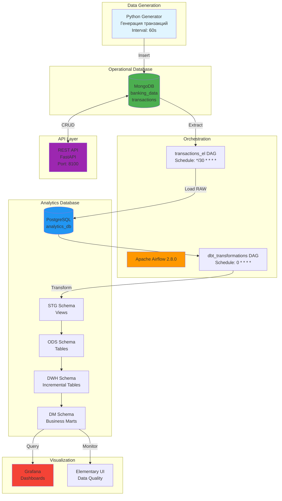
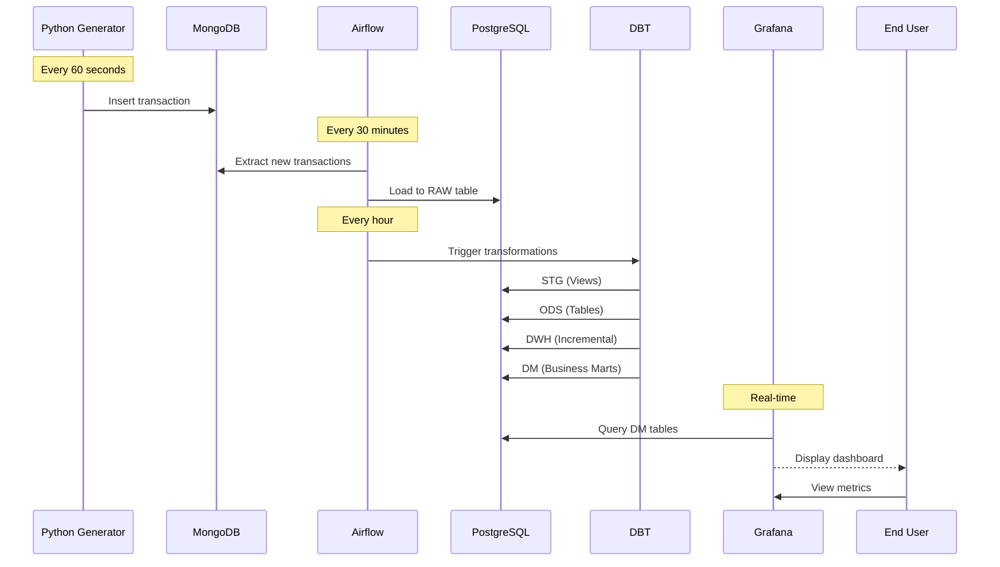
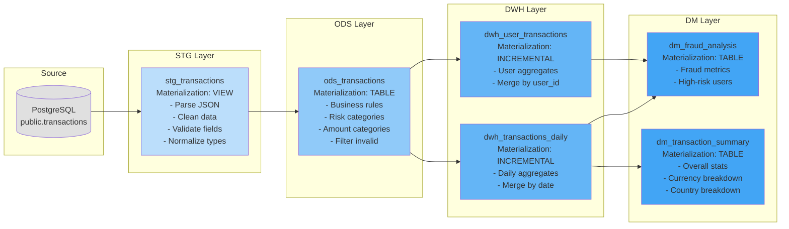
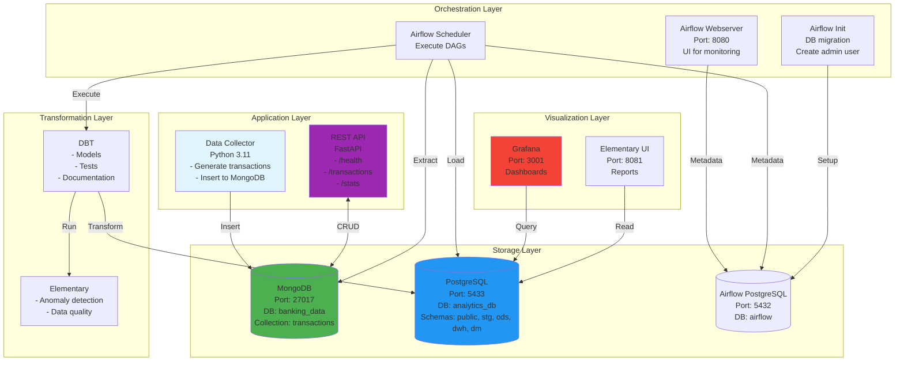
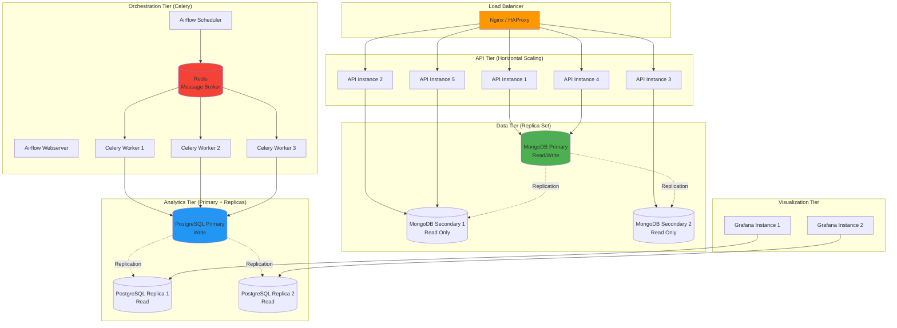
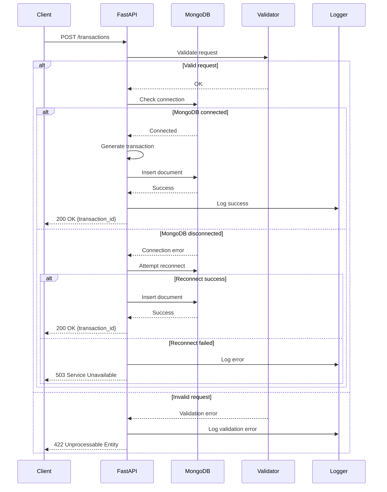
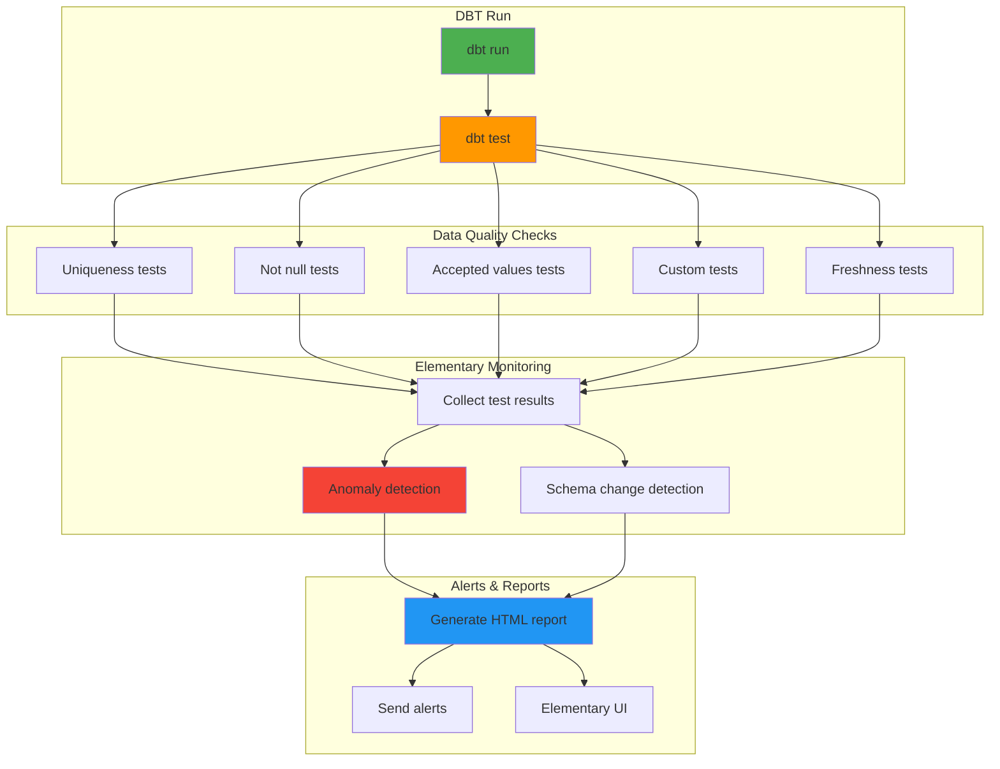
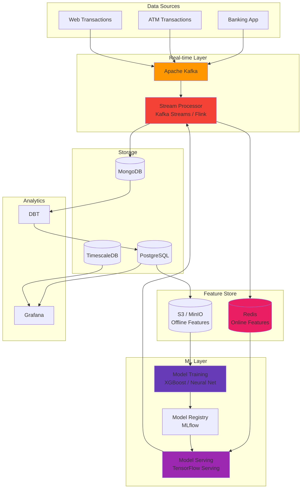

# BankShield: Архитектурные диаграммы

Этот документ содержит детальные диаграммы архитектуры системы BankShield в формате Mermaid.

## 1. Общая архитектура системы (High-Level)

## 2. Поток данных (Data Flow)

## 3. DBT Трансформации (Layered Architecture)

## 4. Airflow DAGs

```mermaid
graph TB
    subgraph "transactions_el DAG"
        START1[Start]
        EXTRACT[Extract from MongoDB<br/>Filter: timestamp > last_run]
        VALIDATE[Validate data]
        LOAD[Load to PostgreSQL<br/>Table: transactions]
        END1[End]
        
        START1 --> EXTRACT
        EXTRACT --> VALIDATE
        VALIDATE --> LOAD
        LOAD --> END1
    end
    
    subgraph "dbt_transformations DAG"
        START2[Start]
        DEPS[dbt deps<br/>Install packages]
        
        subgraph "STG Models"
            STG_RUN[dbt run --select stg.*]
            STG_TEST[dbt test --select stg.*]
        end
        
        subgraph "ODS Models"
            ODS_RUN[dbt run --select ods.*]
            ODS_TEST[dbt test --select ods.*]
        end
        
        subgraph "DWH Models"
            DWH_RUN[dbt run --select dwh.*]
            DWH_TEST[dbt test --select dwh.*]
        end
        
        subgraph "DM Models"
            DM_RUN[dbt run --select dm.*]
            DM_TEST[dbt test --select dm.*]
        end
        
        CUSTOM_TEST[Custom Tests]
        ELEM_RUN[Elementary Anomaly Detection]
        DOCS[Generate Documentation]
        END2[End]
        
        START2 --> DEPS
        DEPS --> STG_RUN
        STG_RUN --> STG_TEST
        STG_TEST --> ODS_RUN
        ODS_RUN --> ODS_TEST
        ODS_TEST --> DWH_RUN
        DWH_RUN --> DWH_TEST
        DWH_TEST --> DM_RUN
        DM_RUN --> DM_TEST
        DM_TEST --> CUSTOM_TEST
        CUSTOM_TEST --> ELEM_RUN
        ELEM_RUN --> DOCS
        DOCS --> END2
    end
    
    style START1 fill:#4caf50
    style END1 fill:#f44336
    style START2 fill:#4caf50
    style END2 fill:#f44336
```

## 5. Компоненты и их взаимодействие

## 6. Масштабирование архитектуры

## 7. Deployment Architecture

```mermaid
graph TB
    subgraph "Production Server (Yandex Cloud)"
        subgraph "Docker Compose Network"
            subgraph "Application Containers"
                DC[data-collector]
                API_C[bankshield-api]
            end
            
            subgraph "Database Containers"
                MONGO_C[mongodb_prod]
                PG_C[postgres_analytics]
                APG_C[airflow-postgres]
            end
            
            subgraph "Airflow Containers"
                INIT_C[airflow-init]
                WEB_C[airflow-webserver]
                SCHED_C[airflow-scheduler]
            end
            
            subgraph "Monitoring Containers"
                GRAF_C[grafana]
                ELEM_C[elementary-ui]
            end
        end
        
        subgraph "Volumes"
            V1[postgres_data]
            V2[mongodb_data]
            V3[airflow_postgres_data]
            V4[grafana_data]
            V5[elementary_reports]
        end
        
        subgraph "Exposed Ports"
            P1[5433:5432 - PostgreSQL]
            P2[27017:27017 - MongoDB]
            P3[8080:8080 - Airflow]
            P4[8100:8000 - API]
            P5[3001:3000 - Grafana]
            P6[8081:8081 - Elementary]
        end
    end
    
    subgraph "External Access"
        USERS[Users / External Systems]
    end
    
    DC --> MONGO_C
    API_C --> MONGO_C
    WEB_C --> APG_C
    SCHED_C --> APG_C
    SCHED_C --> MONGO_C
    SCHED_C --> PG_C
    GRAF_C --> PG_C
    ELEM_C --> PG_C
    
    MONGO_C -.Mount.-> V2
    PG_C -.Mount.-> V1
    APG_C -.Mount.-> V3
    GRAF_C -.Mount.-> V4
    ELEM_C -.Mount.-> V5
    
    USERS -->|HTTP| P3
    USERS -->|HTTP| P4
    USERS -->|HTTP| P5
    USERS -->|HTTP| P6
    
    style DC fill:#e1f5ff
    style API_C fill:#9c27b0
    style MONGO_C fill:#4caf50
    style PG_C fill:#2196f3
    style GRAF_C fill:#f44336
```

## 8. API Request Flow

## 9. Data Quality Monitoring Flow

## 10. Future Architecture (с ML и Real-time)

---

## Легенда

### Цвета компонентов
- 🔵 **Синий** - Базы данных (PostgreSQL)
- 🟢 **Зеленый** - NoSQL БД (MongoDB)
- 🟠 **Оранжевый** - Оркестрация (Airflow)
- 🔴 **Красный** - Визуализация (Grafana)
- 🟣 **Фиолетовый** - API (FastAPI)
- ⚪ **Серый** - Утилиты и вспомогательные компоненты

### Типы связей
- **Сплошная линия** → Основной поток данных
- **Пунктирная линия** ⇢ Репликация / Синхронизация
- **Двунаправленная** ↔ CRUD операции

