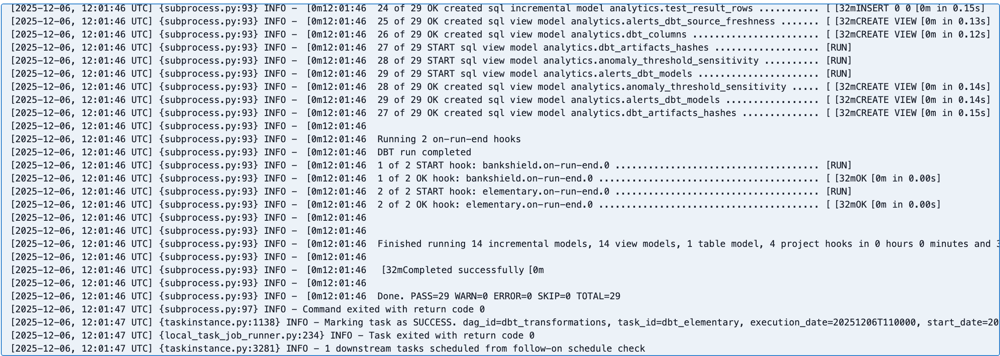
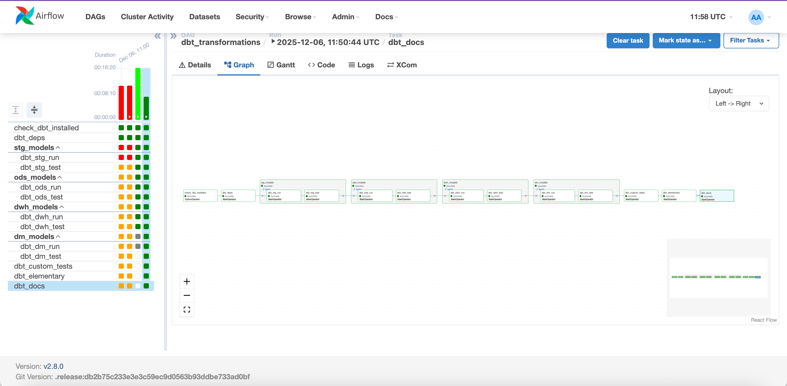

# Отчет по ДЗ 2: DBT и Elementary для BankShield

## Обзор

Настроен DBT проект для трансформации данных транзакций BankShield. Проект включает многослойную архитектуру (STG -> ODS -> DWH -> DM), инкрементальную загрузку, тестирование и интеграцию с Airflow.

## Структура DBT проекта

Проект организован по слоям с использованием тегов и схем для разделения функциональности:

```
dbt/
├── models/
│   ├── stg/          # Staging - очистка и парсинг
│   ├── ods/          # Operational Data Store - нормализация
│   ├── dwh/          # Data Warehouse - агрегаты (инкрементальные)
│   └── dm/           # Data Marts - бизнес-витрины
├── tests/            # Кастомные тесты
├── macros/           # Макросы DBT
└── snapshots/        # Snapshots
```

## Слои моделей

### STG (Staging Layer)

**Назначение**: Очистка и парсинг данных из PostgreSQL

**Модели**:
- `stg_transactions` - очистка, валидация, нормализация данных

**Особенности**:
- Материализация: View
- Схема: `stg`
- Теги: `staging`, `stg`
- Валидация полей (transaction_id, user_id, amount)
- Нормализация валют, типов транзакций, категорий мерчантов
- Вычисляемые поля (transaction_hour, transaction_day_of_week)

### ODS (Operational Data Store)

**Назначение**: Нормализация данных из STG

**Модели**:
- `ods_transactions` - нормализованные транзакции

**Особенности**:
- Материализация: Table
- Схема: `ods`
- Теги: `ods`, `operational`
- Фильтрация невалидных записей
- Бизнес-логика (amount_category, risk_category)
- Индексы для производительности

### DWH (Data Warehouse)

**Назначение**: Аналитические витрины с инкрементальной загрузкой

**Модели**:
- `dwh_transactions_daily` - ежедневная агрегация транзакций
- `dwh_user_transactions` - агрегация по пользователям

**Особенности**:
- Материализация: Incremental Table (merge strategy)
- Схема: `dwh`
- Теги: `dwh`, `warehouse`, `incremental`
- Два вида инкрементальной загрузки (см. ниже)

### DM (Data Marts)

**Назначение**: Бизнес-витрины для анализа

**Модели**:
- `dm_fraud_analysis` - анализ мошенничества
- `dm_transaction_summary` - сводка по транзакциям

**Особенности**:
- Материализация: Table
- Схема: `dm`
- Теги: `dm`, `mart`
- Готовые метрики для бизнес-анализа

## Инкрементальная загрузка

Реализовано два вида инкрементальной загрузки:

### 1. По дате (`dwh_transactions_daily`)

- **Стратегия**: Merge по `transaction_date`
- **Логика**: Обновляет только новые/измененные даты
- **Использование**: Ежедневная агрегация транзакций

### 2. По пользователю (`dwh_user_transactions`)

- **Стратегия**: Merge по `user_id`
- **Логика**: Обновляет только пользователей с новыми транзакциями
- **Использование**: Агрегация метрик на уровне пользователя

## Тестирование

### Встроенные тесты DBT

Реализованы тесты для всех слоев:
- `unique` - уникальность ключей
- `not_null` - обязательные поля
- `accepted_values` - валидация значений
- `dbt_utils.accepted_range` - валидация диапазонов

**Примеры**:
- Проверка уникальности `transaction_id`
- Валидация `risk_score` в диапазоне 0-1
- Проверка валют (USD, EUR, RUB)
- Валидация типов транзакций

### Кастомные тесты

Создано 4 кастомных теста:

1. **test_fraud_rate.sql** - проверка, что fraud_rate не превышает 1.0
2. **test_fraud_consistency.sql** - консистентность между fraud_transactions и fraud_rate
3. **test_amount_consistency.sql** - валидация неотрицательности сумм
4. **test_user_fraud_consistency.sql** - консистентность фрод-метрик на уровне пользователя

### Elementary

Настроен Elementary для мониторинга качества данных:
- Anomaly detection
- Schema changes monitoring
- Data quality tests

Конфигурация в `elementary.yml`:
- Включен мониторинг артефактов DBT
- Настроена детекция аномалий
- Мониторинг изменений схемы



## Документация

### Источники данных

Описаны источники в `sources.yml`:
- Таблица `transactions` из PostgreSQL
- Описание всех колонок
- Тесты на уровне источников

### Модели

Документация моделей в `schema.yml` для каждого слоя:
- Описание моделей
- Описание колонок
- Тесты на уровне колонок

## Интеграция с Airflow

### DAG: dbt_transformations

Создан DAG для автоматического запуска DBT пайплайнов:

**Расписание**: Каждый час

**Структура**:
1. Проверка установки DBT
2. Установка зависимостей (`dbt deps`)
3. STG модели (run + test)
4. ODS модели (run + test)
5. DWH модели (run + test) - инкрементальные
6. DM модели (run + test)
7. Кастомные тесты
8. Elementary anomaly detection
9. Генерация документации



**Task Groups**:
- `stg_models` - staging layer
- `ods_models` - operational data store
- `dwh_models` - data warehouse
- `dm_models` - data marts

## Схемы в PostgreSQL

После запуска DBT создаются следующие схемы:

- `stg` - staging модели (views)
- `ods` - operational data store (tables)
- `dwh` - data warehouse (incremental tables)
- `dm` - data marts (tables)

## Аналитические витрины

### dm_fraud_analysis

Бизнес-витрина для анализа мошенничества:
- Ежедневная статистика по фрод-транзакциям
- Высокорисковые пользователи
- Метрики: fraud_rate, fraud_amount, risk_score

### dm_transaction_summary

Сводка по транзакциям:
- Общая статистика
- Разбивка по валютам
- Разбивка по странам
- Общие метрики и тренды

## Ссылки

- **Airflow UI**: http://158.160.186.46:8080 (airflow/airflow)
- **DBT DAG**: `dbt_transformations`
- **PostgreSQL**: `158.160.186.46:5433` (analytics_user/analytics_password)

## Credentials для подключения

**PostgreSQL**:
- Host: `158.160.186.46`
- Port: `5433`
- Database: `analytics_db`
- User: `analytics_user`
- Password: `analytics_password`

**Схемы для просмотра витрин**:
- `stg.stg_transactions` - staging данные
- `ods.ods_transactions` - нормализованные данные
- `dwh.dwh_transactions_daily` - ежедневные агрегаты
- `dwh.dwh_user_transactions` - агрегаты по пользователям
- `dm.dm_fraud_analysis` - анализ мошенничества
- `dm.dm_transaction_summary` - сводка по транзакциям
